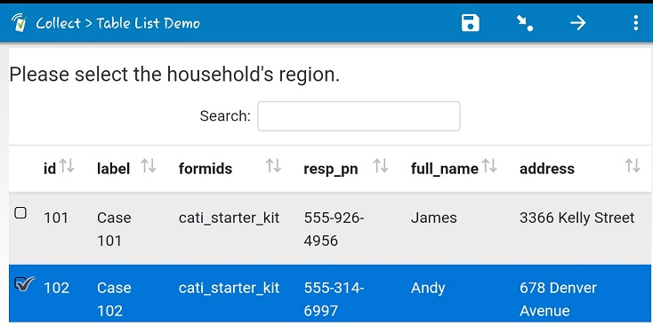

# Table list

## Description

This field plug-in allows for choice lists to be presented in the form of a table. The table can be created from correctly formatted static or [pre-loaded choices](https://docs.surveycto.com/02-designing-forms/04-sample-forms/12.search-and-select.html). The table further allows for sorting for each column and also searching for across the table. [ARCED](https://arced.foundation) team added a new parameter that allows pagination in the table.  See the [Parameters section](#parameters) below.

## Default SurveyCTO feature support

| Feature / Property | Support |
| --- | --- |
| Supported field type(s) | `select_one` `select_multiple`|
| Default values | No |
| Custom constraint message | Yes |
| Custom required message | Yes |
| Read only | No |

Using multiple pre-load data columns as labels with the search() function is also not supported. Instead, you will store a delimited table in a single column of pre-load data. See below and the [wiki](https://github.com/surveycto/table-list/wiki/Table-list-view-field-plugin) for more.

## How to use

1. Download the test form [extras/sample-form](https://github.com/surveycto/table-list/raw/master/extras/example_form/table-list%20sample%20folder.zip) from this repo and upload it to your SurveyCTO server.
1. Download the [table-list.fieldplugin.zip](https://github.com/surveycto/table-list/raw/master/table-list.fieldplugin.zip) file from this repo, and attach it to the test form on your SurveyCTO server.
1. Make sure to provide the correct parameters (see below).

## Parameters

| **Key** | **Value** |
| --- | --- |
| `delimiter` | Used to set the delimiter used in the choice label column (or column of pre-loaded data that contains the table). |
| `headers` | A comma separated list of table headers. The number of these should match the expected number of columns in the choice label column (or column of csv or dataset) |
| `page` | 'True' or 'False'. 'True' creates paginated table. |

> **Example:**  
> If you have an appearance of `custom-table-list(delimiter='|', headers = 'ID, Description, Colour')`
> the corresponding choice list could look like this:

| **list_name**| **value** | **label** |
| --- | ---| --- |
|product|1|1 &#124; Digissim &#124; Blue|

> The values in the label column will fall under the columns represented by the values in the headers parameter. This will display the table below.

| ID | Description | Colour |
| --- | --- | --- |
| 1 | Digissim | Blue |

You can read more about how to use this plugin [here](https://github.com/surveycto/table-list/wiki/Table-list-view-field-plugin) (includes a downloadable step-by-step breakdown of using this field plug-in).

## More resources

* **Sample form**  
You can find a form definition in this repo here: [extras/sample_form](https://github.com/surveycto/table-list/raw/master/extras/example_form/table-list%20sample%20folder.zip).

* **Developer documentation**  
More instructions for developing and using field plug-ins can be found here: [https://github.com/surveycto/Field-plug-in-resources](https://github.com/surveycto/Field-plug-in-resources)

* **User documentation**
How to get started using field plug-ins in your SurveyCTO form.
(https://docs.surveycto.com/02-designing-forms/03-advanced-topics/06.using-field-plug-ins.html)
